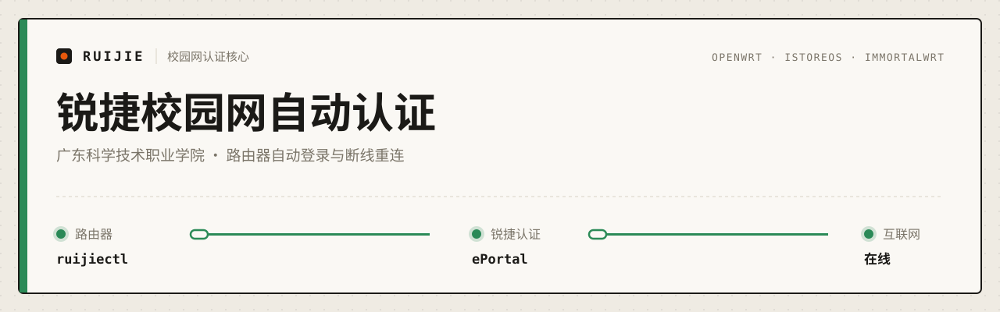

<p align="center">
  
</p>

<p align="center">
  <a href="https://github.com/huantuoshen-prog/ruijie-gdstvc-autologin/actions"></a>
  <a href="https://github.com/huantuoshen-prog/ruijie-gdstvc-autologin/releases"></a>
  <a href="https://github.com/koalaman/shellcheck"></a>
  
</p>

<p align="center">
  <b>01</b> <a href="#一行安装">一行安装</a> ·
  <b>02</b> <a href="#它做什么">它做什么</a> ·
  <b>03</b> <a href="#常用命令">常用命令</a> ·
  <b>04</b> <a href="#文档">文档</a> ·
  <b>05</b> <a href="#相关项目">相关项目</a>
</p>

---

让 OpenWrt 路由器替你完成广东科学技术职业学院（广科院、GDSTVC）校园网的锐捷 Web 认证，断线后自动重连。宿舍里的手机、电脑、平板接上这台路由器就能上网。

```text
 router ─────▶ ruijie ePortal ─────▶ internet
 ruijiectl
```

> [!NOTE]
> 只支持 OpenWrt、iStoreOS、ImmortalWrt 等 OpenWrt 系固件，不支持在 Windows、macOS 或普通 Linux 桌面上直接安装。

## 一行安装

<sub><code>01</code></sub>

在路由器的 SSH / TTYD 终端执行。它会下载固定的 v4.0.0 完整包、校验文件并安装核心，**不会**主动认证或退出校园网：

```sh
T="$(mktemp -d /tmp/ruijie-core.XXXXXX)" && cd "$T" && curl -fsSLO https://github.com/huantuoshen-prog/ruijie-gdstvc-autologin/releases/download/v4.0.0/ruijie-core-4.0.0.tar.gz && curl -fsSLO https://github.com/huantuoshen-prog/ruijie-gdstvc-autologin/releases/download/v4.0.0/SHA256SUMS && grep ' ruijie-core-4.0.0.tar.gz$' SHA256SUMS | sha256sum -c - && tar -xzf ruijie-core-4.0.0.tar.gz && cd ruijie-core && sha256sum -c manifest.sha256 && sh install.sh
```

更想用网页管理？下载 [Web 面板组合包](https://github.com/huantuoshen-prog/ruijie-web-panel/releases/tag/v4.0.0)，里面已经带了匹配的核心和面板。

<details>
<summary>分步安装（想看清每一步在做什么）</summary>

```sh
cd /tmp
curl -fLO https://github.com/huantuoshen-prog/ruijie-gdstvc-autologin/releases/download/v4.0.0/ruijie-core-4.0.0.tar.gz
curl -fLO https://github.com/huantuoshen-prog/ruijie-gdstvc-autologin/releases/download/v4.0.0/SHA256SUMS
grep ' ruijie-core-4.0.0.tar.gz$' SHA256SUMS | sha256sum -c -
mkdir -p /tmp/ruijie-core
tar -xzf ruijie-core-4.0.0.tar.gz -C /tmp/ruijie-core
cd /tmp/ruijie-core/ruijie-core
sha256sum -c manifest.sha256
sh install.sh

/etc/ruijie/ruijiectl runtime
```

配置账号、启动自动重连、主动下线都是分开的显式操作。完整步骤与回滚方法见 [安装文档](./docs/install.md)。

</details>

## 它做什么

<sub><code>02</code></sub>

| 能力 | 说明 |
|---|---|
| **自动认证** | 完成锐捷 Web / ePortal 认证，只有联网复检通过才记为成功 |
| **断线重连** | 守护进程常驻后台，按节奏检测并恢复认证 |
| **账号类型** | 学生账号、教师账号 |
| **运营商** | 校园电信、校园联通 |
| **健康监听** | 定时采样和事件日志，方便定位偶发掉线 |
| **JSON CLI** | `ruijiectl` 统一输出 JSON，面板和 Agent 都直接调用它 |

守护进程的状态机：

```text
 ONLINE ──▶ CHECKING ──▶ RETRYING ──▶ WAIT_LONG
   ▲           │            │             │
   └───────────┴────────────┴─────────────┘
```

| 状态 | 含义 | 下一步 |
|---|---|---|
| `ONLINE` | 在线，定期检测连通性 | 确认离线 → `CHECKING` |
| `CHECKING` | 立即尝试一次认证 | 成功 → `ONLINE`，失败 → `RETRYING` |
| `RETRYING` | 指数退避重试 | 成功 → `ONLINE`，退避 4 次 → `WAIT_LONG` |
| `WAIT_LONG` | 每 5 分钟尝试一次 | 成功 → `ONLINE` |

适合哪些场景：

| 场景 | 推荐做法 |
|---|---|
| 宿舍多台设备共用 | 装在路由器上，配置一次后自动保活 |
| 想要图形界面 | 搭配 [ruijie-web-panel](https://github.com/huantuoshen-prog/ruijie-web-panel) |
| 想让 Agent 排障 | 开启健康监听，用 JSON 接口和健康日志定位问题 |

## 常用命令

<sub><code>03</code></sub>

| 场景 | 命令 |
|---|---|
| 查看运行环境 | `/etc/ruijie/ruijiectl runtime` |
| 查看统一状态 | `/etc/ruijie/ruijiectl status` |
| 启动自动重连 | `/etc/ruijie/ruijiectl service start` |
| 暂停自动重连 | `/etc/ruijie/ruijiectl service stop` |
| 确保当前在线 | `/etc/ruijie/ruijiectl auth ensure` |
| 强制重新认证 | `/etc/ruijie/ruijiectl auth reauth` |
| 主动断开认证 | `/etc/ruijie/ruijiectl auth logout` |
| 查看脱敏配置 | `/etc/ruijie/ruijiectl config get` |

## 文档

<sub><code>04</code></sub>

| 文档 | 内容 |
|---|---|
| [安装](./docs/install.md) | 固定发布包安装、升级、回滚 |
| [命令与配置](./docs/cli-and-config.md) | 完整参数、配置文件、代理、退出码 |
| [守护进程与健康监听](./docs/daemon-and-health.md) | 认证流程、状态机、健康监听、日志与状态文件 |
| [故障排除](./docs/troubleshooting.md) | 安装、认证、守护进程问题与卸载 |
| [开发](./docs/development.md) | 项目结构、模块说明、测试 |
| [Agent 安装 Prompt](./docs/AGENT_INSTALL_PROMPT.md) | 交给 Agent 代为安装（默认按路由器部署） |
| [Agent 调试 Prompt](./docs/AGENT_DEBUG_PROMPT.md) | 安装后交给 Agent 排障 |
| [更新记录](./CHANGELOG.md) | 版本历史 |

## 相关项目

<sub><code>05</code></sub>

| 项目 | 说明 |
|---|---|
| [**ruijie-web-panel**](https://github.com/huantuoshen-prog/ruijie-web-panel) | Web 管理面板，在浏览器里管理账号、守护进程和日志 |
| [Qclaw](https://github.com/qiuzhi2046/Qclaw) | OpenClaw 桌面管家（非本项目） |

---

<sub>
欢迎提 issue：新生安装体验、不同宿舍楼的认证差异、固件兼容性和文档错字都有用。提交前请删掉账号、密码、MAC 地址、内网 IP 和完整认证链接。<br>
本项目不是学校官方软件，不会替代学校网络规定，账号密码仍由你本人保管。MIT 许可证，见 <a href="./LICENSE">LICENSE</a>。<br>
关键词：OpenWrt 锐捷认证 · 校园网自动登录 · 广东科学技术职业学院 · 广科院 · GDSTVC · iStoreOS · ImmortalWrt · ePortal · captive portal
</sub>
